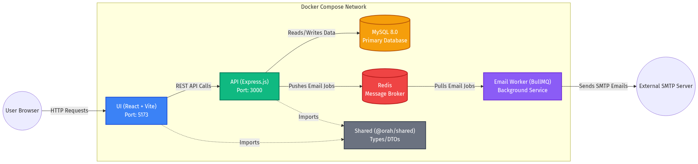
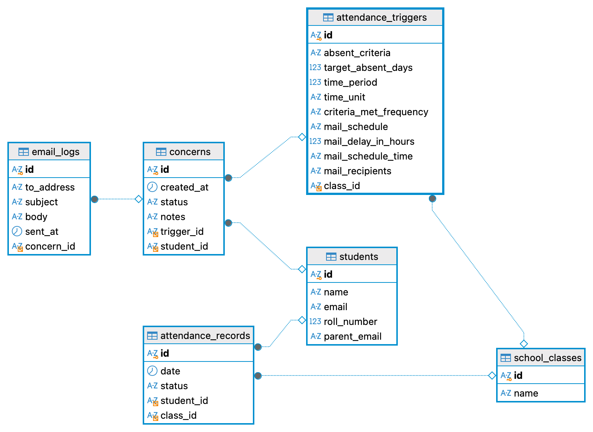

# Orah Assignment 🚀

A modern full-stack web application designed for attendance tracking, concern management, and automated email notifications.

---

## 🏗️ Project Architecture & Modules

The application is structured into several isolated microservices. Below is a breakdown of each module and the internal/external addresses on which they run.

| Module | Description | Internal Docker Address | External (Host) Address |
| :--- | :--- | :--- | :--- |
| **UI** (`/ui`) | Frontend application built with Vite and React. Serves the interactive user dashboards and dashboards. | `ui:5173` | `http://localhost:5173` |
| **API** (`/api`) | Core backend Express.js server. Handles HTTP requests, triggers cron jobs, and reads/writes to MySQL. | `api:3000` | `http://localhost:3000` |
| **Email Worker** (`/email`) | Background microservice running a BullMQ consumer. Processes queued tasks to send real emails via Nodemailer. | `email` (No exposed port) | _Not exposed_ |
| **Database** (`mysql`) | MySQL 8.0 instance storing relational data (students, classes, concerns, email logs). | `mysql:3306` | `127.0.0.1:3306` |
| **Message Broker** (`redis`) | In-memory Redis store used by BullMQ to queue background tasks (like sending emails). | `redis:6379` | `127.0.0.1:6379` |

---

## 🐳 Docker Orchestration

The entire environment is containerized. Docker Compose orchestrates the building of shared resources, the startup of data stores, schema migrations, and finally booting up the services.

### How to Start and Stop Services

| Action | Command / Script | Description |
| :--- | :--- | :--- |
| **Start Everything** | `./start.sh` | Cleans up corrupted volumes, runs `docker-compose up -d`, and outputs a health status report of the running containers. |
| **Stop Everything** | `./stop.sh` | Runs `docker-compose down` to gracefully stop all active containers, destroy the network, and release ports. (Does *not* delete databases volumes). |

---

## 💻 API Development Commands

If you choose to run or test the `api` module natively on your machine (outside of Docker), navigate to the `/api` folder and use the following NPM commands.

| Command | Action | Description |
| :--- | :--- | :--- |
| `npm run dev` | **Start Dev Server** | Compiles TypeScript, starts the server on port 3000, and enables hot-reloading via `node --watch`. |
| `npm run start` | **Start Prod Server** | Runs the compiled JavaScript application (`node dist/server.js`). |
| `npm run build` | **Compile TypeScript** | Transpiles `.ts` files inside `src/` to `.js` files inside `dist/`. |
| `npm run format` | **Format Code** | Runs Prettier against all TypeScript source files to ensure standard styling. |
| `npm run db:sync` | **Sync DB Schema** | Compares the TypeORM entities to the MySQL database and executes SQL to match them. |
| `npm run db:drop` | **Drop DB Schema** | Wipes all tables, columns, and relations from the connected database. |
| `npm run db:seed` | **Seed Database** | Runs the custom `seed.ts` script to populate dummy classes and students. |
| `npm run cleanup` | **Reset Database** | Triggers `db:drop`, then `db:sync`, and finally `db:seed`. *(Docker runs this automatically on boot!)* |

---

## 🗄️ Database Entity-Relationship (ER) Diagram

The application uses MySQL to store deeply relational data. The diagram above outlines the key entities:
- **Students** and **SchoolClasses** form the core domain.
- **AttendanceTriggers** act as active policies tied to a specific class.
- When criteria are met, a **Concern** is generated for a Student based on a Trigger.
- The Email Worker queues background tasks and logs every successfully dispatched email in the **EmailLog** table, which allows you to track the exact history of notifications per Concern.
